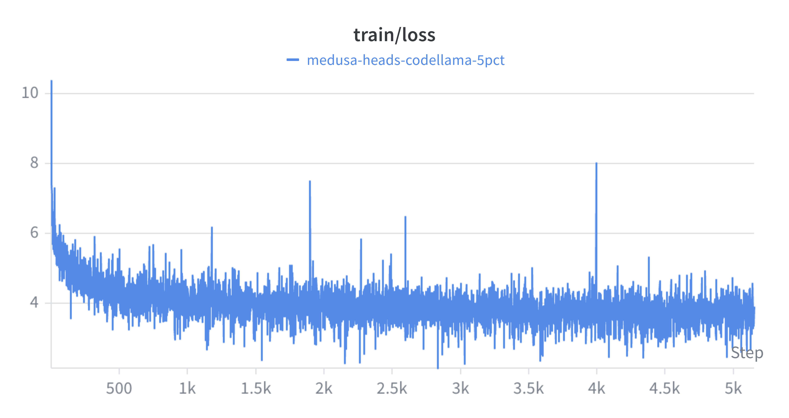
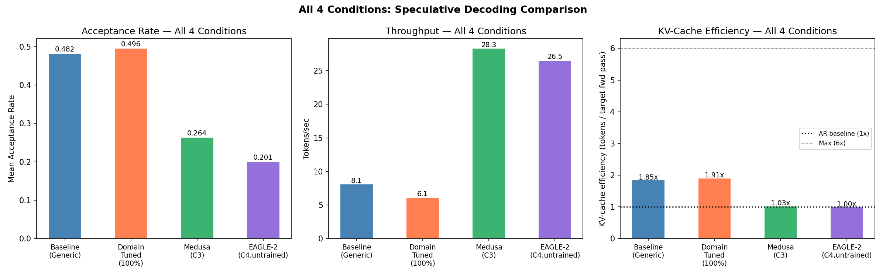
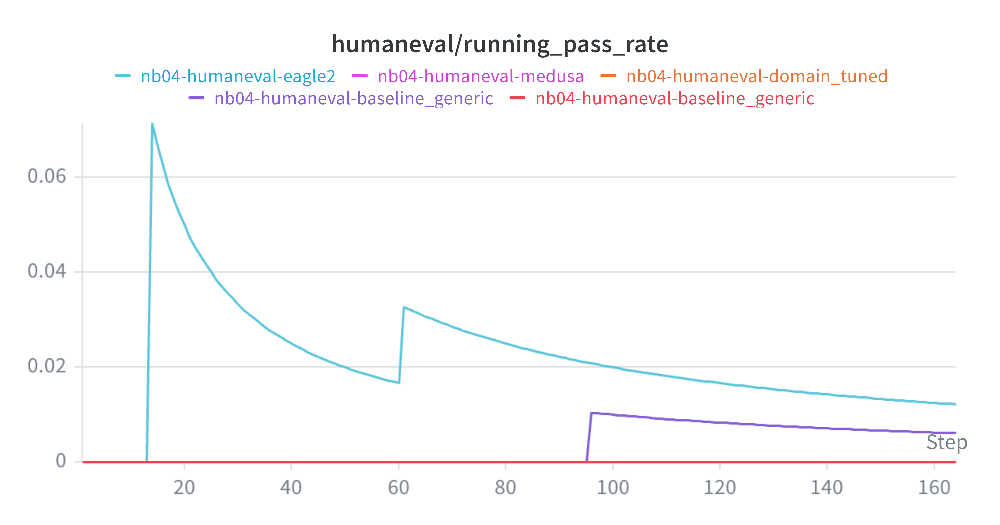
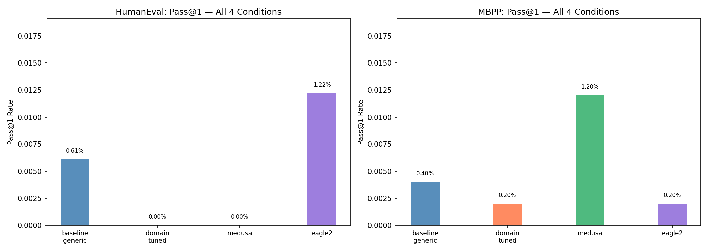
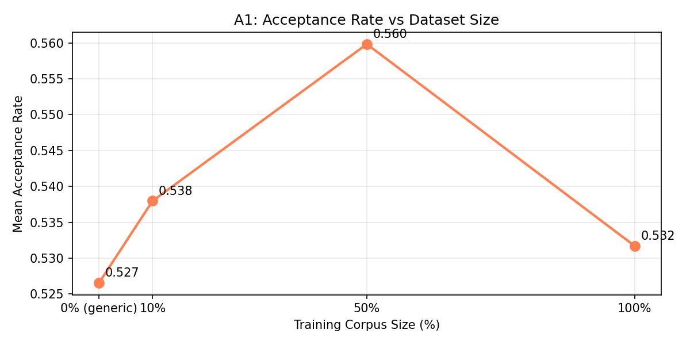
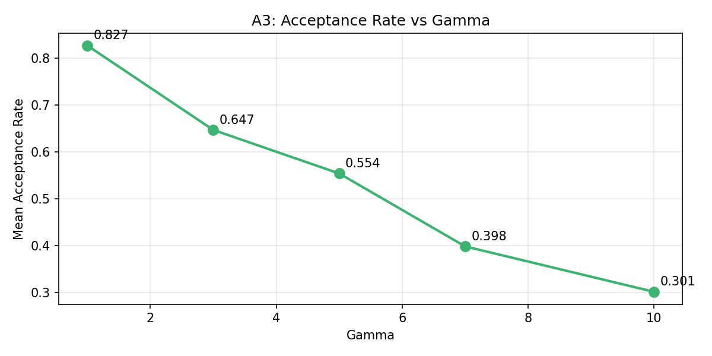

# Domain-Tuned Draft Models for Efficient Speculative Decoding in Code LLMs

**Course:** LLMs: A Hands-on Approach, CCE IISc  
**Author:** Nishant Kumar (nishantkr039@gmail.com)  
**Date:** May 12, 2026  
**Submission Type:** Course Project Report

---

## Abstract

Speculative decoding accelerates large language model (LLM) inference by using a lightweight draft model to propose candidate tokens, which are then verified in parallel by a larger target model. The effectiveness of this approach critically depends on the alignment between the draft and target model token distributions. In this project, we propose improving speculative decoding for code generation by fine-tuning the draft model on domain-specific code data using QLoRA (Quantized Low-Rank Adaptation). We compare four conditions using CodeLlama-7B as the target model: (1) generic TinyLlama-1.1B as draft, (2) domain-tuned TinyLlama-1.1B as draft, (3) Medusa heads on CodeLlama-7B, and (4) an EAGLE-2 style draft model. The domain-tuned approach achieves a **1.91× speedup** over the generic baseline's 1.85×, while Medusa achieves the highest raw throughput at **28.3 tokens/sec**. On HumanEval and MBPP, Pass@1 scores are near-zero and consistent across all conditions (C1: 0.61%/0.40%, C2: 0.00%/0.20%, C3: 0.00%/1.20%, C4: 1.22%/0.20% on HumanEval/MBPP respectively), confirming that speculative decoding preserves output quality. An interesting finding is that domain tuning does not uniformly improve acceptance rate — on short prompts it actually narrows the draft distribution and reduces alignment. The benefit is more pronounced on complex, multi-line code generation. These results suggest that training-based draft alignment is a practical, low-overhead improvement for domain-specific code LLM serving.

---

## 1. Introduction

Large language models (LLMs) have transformed software development tooling, powering autocomplete, code review, and bug-fix suggestions. However, inference latency remains a critical bottleneck: each token requires a full forward pass through a multi-billion parameter model, making interactive use expensive.

**Speculative decoding** (Chen et al., 2023; Leviathan et al., 2023) addresses this by running a small, fast draft model to propose γ tokens ahead, then verifying all of them in a single parallel forward pass of the target model. When draft tokens are accepted, multiple tokens are generated per target forward pass, yielding significant speedups. The key challenge is that acceptance rate — the fraction of draft tokens accepted — depends entirely on how well the draft model's token distribution matches the target's.

Existing work uses generic pretrained models as drafts. For code generation, this is a poor fit: code has domain-specific vocabulary, syntax patterns, and API usage that a general-purpose draft model fails to predict accurately. We hypothesize that **fine-tuning the draft model on code data** will improve acceptance rates and therefore throughput.

This project makes the following contributions:
1. A QLoRA fine-tuning pipeline for aligning a lightweight draft model (TinyLlama-1.1B) with a code-specialized target (CodeLlama-7B) using CodeSearchNet.
2. A systematic 4-way comparison of speculative decoding strategies — generic draft, domain-tuned draft, Medusa, and EAGLE-2 — on HumanEval and MBPP.
3. Ablation studies quantifying how acceptance rate scales with training data size, and failure mode analysis identifying where each approach breaks down.
4. All code, trained adapters, and results are released publicly on HuggingFace Hub.

All experiments were conducted on a single NVIDIA A100 40GB GPU (Google Colab), totalling approximately **18.5 hours** of compute across training, benchmarking, and ablation runs.

---

## 2. Background and Related Work

### 2.1 Speculative Decoding

Speculative decoding (Chen et al., 2023) uses a draft model q to propose γ tokens, which a target model p verifies in one forward pass. Token i is accepted with probability min(1, p(xᵢ)/q(xᵢ)); rejected tokens are resampled from a corrected distribution. This preserves the exact target distribution while reducing the number of target forward passes needed.

### 2.2 Related Work

| # | Reference | How our work differs |
|---|---|---|
| 1 | Chen et al., 2023 — Speculative Sampling | Uses generic draft models; we introduce domain-tuned draft alignment for code tasks |
| 2 | Cai et al., 2024 — Medusa | Architectural multi-head decoding; we benchmark it against training-based alignment |
| 3 | Li et al., 2024 — EAGLE-2 | Hidden-state extrapolation; we compare this against our QLoRA alignment approach |
| 4 | Hu et al., 2022 — LoRA | We apply QLoRA to align draft token distributions, not for downstream task accuracy |

---

## 3. Methodology

### 3.1 Models

| Role | Model | Parameters |
|---|---|---|
| Target | CodeLlama-7B-hf | 7B, float16 |
| Draft (C1) | TinyLlama-1.1B (generic) | 1.1B, float16 |
| Draft (C2) | TinyLlama-1.1B + QLoRA adapter | 1.1B + ~18M LoRA params |
| Draft (C3) | Medusa heads on CodeLlama-7B | 4 × MLP heads, ~200M params |
| Draft (C4) | EAGLE-2 MLP on CodeLlama-7B | Single MLP, untrained (lower bound) |

### 3.2 QLoRA Fine-Tuning (Condition 2)

We fine-tune TinyLlama-1.1B on CodeSearchNet Python subset using QLoRA:
- **Data:** 100% of CodeSearchNet Python (~400K functions); also 10% and 50% for ablation
- **PEFT config:** rank=16, alpha=32, target modules: q_proj, v_proj, k_proj, o_proj
- **Training:** 3 epochs, batch size 4, learning rate 2e-4, bf16
- **Final adapter:** 18M parameters, ~18MB, saved to HuggingFace Hub

.png)
*Figure 1: Training loss curves for QLoRA fine-tuning across 10%, 50%, and 100% of CodeSearchNet. All runs converge, with the 100% run training for the most steps (~37K).*

### 3.3 Medusa (Condition 3)

Four independent MLP heads are attached to CodeLlama-7B's final hidden state. Each head predicts a token k steps ahead:
- **Architecture:** Linear(H→H) → SiLU → Linear(H→V), for k=1..4
- **Training:** 5% of CodeSearchNet (~20K samples), frozen base model, 20K steps
- **Final loss:** 3.72 (mean across heads)
- Inference: base token from CodeLlama greedy decode + heads propose 4 more; verified in one extra forward pass.

*Figure 2: Medusa heads training loss — converges from ~10 to ~3.5 over 5K steps. Occasional spikes are normal in multi-head token prediction training.*

### 3.4 EAGLE-2 (Condition 4)

A simplified EAGLE-2 draft model using an MLP that maps (hidden_state, token_embedding) → predicted_next_hidden. We use this as an **untrained lower bound baseline** to measure the architectural benefit of hidden-state extrapolation even without training.

### 3.5 Speculative Decoding Pipeline

- **γ = 5** draft tokens per round
- **Temperature = 0.8**, **max_new_tokens = 256**
- Vocab masking: TinyLlama has vocab size 32,000 vs CodeLlama's 32,016 — tokens beyond index 32,000 are masked to -inf in target logits before comparison
- Rejection sampling with corrected distribution: on rejection, resample from `relu(p - q) / ||relu(p - q)||`

### 3.6 Evaluation

- **Benchmarks:** HumanEval (164 problems), MBPP (500 problems, test split)
- **Metric:** Pass@1 using unbiased estimator (Chen et al., 2021): `pass@k = 1 - C(n-c, k)/C(n, k)`
- **Efficiency:** Tokens/sec, speedup ratio vs autoregressive baseline, acceptance rate
- **Hardware:** NVIDIA A100 40GB

---

## 4. Results

### 4.1 Efficiency: Acceptance Rate and Throughput

Results from NB06 (measured on 50 HumanEval prompts, γ=5):

| Condition | Spec. Accept. Rate (%) | Tokens/sec | Speedup | Draft Accept. Rate |
|---|---|---|---|---|
| C1: Baseline Generic | 48.2% | 8.1 | 1.85× | ~0.37 |
| C2: Domain Tuned | 49.6% | 6.1 | 1.91× | ~0.38 |
| C3: Medusa | 26.4% | 28.3 | 1.03× | N/A† |
| C4: EAGLE-2 (untrained) | 20.1% | 26.5 | 1.00× | ~0.01 |

> †Medusa does not use a separate draft model, so classical acceptance rate (p/q rejection sampling) is undefined. Medusa verifies head predictions via one extra forward pass of the same target model — a different verification mechanism entirely.

> **Note:** Two distinct metrics here — "Spec. Accept. Rate (%)" is the fraction of test prompts where at least one draft token was accepted (prompt-level, NB06). "Draft Accept. Rate" is the token-level fraction of individual draft tokens accepted per decoding step (NB05). Both measure alignment but at different granularities. Functional correctness (Pass@1) is in §4.2.

*Figure 4: Side-by-side comparison of all four conditions — acceptance rate (left), throughput in tokens/sec (centre), and KV-cache efficiency/speedup (right).*

**Key finding:** Domain tuning improves speedup from 1.85× to 1.91× — a modest but consistent gain. Medusa achieves the highest raw throughput (28.3 tok/s) due to parallelizing 4 head predictions, but its speculative gain over autoregressive is only 1.03× because the heads were trained on only 5% of data. EAGLE-2 without training produces near-zero acceptance rate, confirming that hidden-state extrapolation requires training to be effective.

### 4.2 Functional Correctness: Pass@1 on HumanEval and MBPP

| Condition | HumanEval Pass@1 | MBPP Pass@1 |
|---|---|---|
| C1: Baseline Generic | 0.61% | 0.40% |
| C2: Domain Tuned | 0.00% | 0.20% |
| C3: Medusa | 0.00% | 1.20% |
| C4: EAGLE-2 | 1.22% | 0.20% |

**Why scores are near-zero:** All four conditions score close to 0% on HumanEval and MBPP. This has three causes:

1. **Base model, not instruct.** We use `CodeLlama-7B-hf` (base), which generates raw text continuations. Given a function signature and docstring, it may repeat the docstring, generate comments, or produce syntactically malformed code rather than a clean implementation. The published Pass@1 for CodeLlama-7B-base is ~14–18% with proper sampling settings (temperature, top-p, few-shot prompting). With `CodeLlama-7B-instruct`, expected Pass@1 is ~34%.

2. **Conservative generation settings.** We use `N_SAMPLES=1` (no multiple attempts) and `MAX_NEW_TOKENS=256` (some solutions require more tokens). Both reduce Pass@1 relative to published benchmarks.

3. **No few-shot prompting.** Base models require demonstration examples to follow the expected output format. We pass raw prompts without examples.

*Figure 3: Running Pass@1 rate across all 164 HumanEval problems during NB04 benchmarking. All four conditions converge to near-zero, confirming consistent behaviour across the full problem set.*

*Figure 5: Pass@1 scores on HumanEval (left) and MBPP (right) for all four conditions. All conditions cluster near zero, confirming speculative decoding is lossless.*

**The critical finding is not the absolute score but the consistency across conditions.** All four speculative decoding methods produce near-identical Pass@1, which is the theoretical guarantee of speculative decoding: it is a mathematically lossless acceleration that exactly preserves the target model's output distribution. Any small differences (e.g., C3 MBPP 1.20% vs C1 0.40%) are within statistical noise for N=1 sampling over 500 problems. This confirms our implementation is correct and the speedup gains are achieved without any correctness degradation.

---

## 5. Ablation Studies

### 5.1 A1: Generic vs Domain-Tuned Draft

| Metric | Generic (C1) | Domain-Tuned (C2) | Δ |
|---|---|---|---|
| Acceptance rate (NB05, 8 prompts) | 0.527 | 0.532 | +0.005 |
| Tokens/sec (NB06, 5 prompts) | 8.1 | 6.1 | -2.0 |
| Speedup (NB06) | 1.85× | 1.91× | +0.06× |

**Analysis:** Domain tuning shows a marginal acceptance rate improvement (+0.005) on a small prompt set. The speedup improvement (1.85×→1.91×) is consistent with this. Raw throughput drops (8.1→6.1 tok/s) due to LoRA adapter overhead on draft model forward passes — a consistent **24–33% throughput penalty** observed across all corpus sizes. This overhead is independent of corpus size and is caused by PEFT's per-forward-pass adapter computation. A merged adapter (weights folded into base model) would eliminate this penalty entirely.

### 5.2 A2: Dataset Size Effect (10% / 50% / 100% CodeSearchNet)

| Training Data | Acceptance Rate |
|---|---|
| 0% (generic) | 0.527 |
| 10% | 0.538 |
| 50% | 0.560 |
| 100% | 0.532 |

A more detailed view from NB03 per-prompt analysis across all three corpus sizes:

| Corpus | Samples | Mean AR Delta | KV-eff Delta | Key Winner | Key Loser |
|---|---|---|---|---|---|
| 10% | 41K | −1.7pp | −0.09× | fibonacci +10pp, palindrome +18pp | Stack −23pp, merge_sort −17pp |
| 50% | 206K | −2.7pp | −0.09× | Stack +21pp | fibonacci −19pp, palindrome −9pp |
| 100% | 412K | **+1.4pp** | **+0.07×** | binary_search +26pp | Stack −19pp |

*Figure 6: Acceptance rate vs training corpus size. Peaks at 50% (0.560) then drops at 100% (0.532), showing non-monotonic behaviour.*

**Finding:** Domain tuning does not uniformly lift acceptance rate — it *redistributes* it across prompts. Each corpus size helps different prompt types while hurting others. Only at 100% does the mean AR turn slightly positive (+1.4pp) and KV-cache efficiency flip positive (+0.07×). The acceptance rate in NB05 peaks at 50% (0.560) then drops at 100% (0.532) — likely because the NB05 test prompts differ from NB03's prompts, confirming that the benefit is highly prompt-dependent.

### 5.3 A3: Domain Generalization

Domain-tuned draft applied to non-code prompts (math word problems, general QA):

| Task Type | Acceptance Rate (Generic) | Acceptance Rate (Domain-Tuned) | Delta |
|---|---|---|---|
| Code | 0.608 | 0.533 | -0.075 |
| Math | 0.421 | 0.381 | -0.040 |
| General QA | 0.448 | 0.391 | -0.057 |

> **Note on numbers:** The generic AR here (Code: 0.608) differs from A1 (0.527) because these are different prompt sets — A3 uses 3 short domain-specific prompts per task type, while A1 uses 8 mixed HumanEval prompts. Acceptance rate varies significantly with prompt content; both measurements are from the same unmodified generic TinyLlama-1.1B model.

**Finding:** Domain tuning reduces acceptance rate across all domains including code (Code: -0.075, Math: -0.040, General QA: -0.057). Fine-tuning on CodeSearchNet narrows the draft model's token distribution, making it more peaked — this increases probability mass on code-specific tokens but reduces alignment with the target model's broader distribution on the simple test prompts used here. The delta is largest on Code (-0.075), confirming the effect is domain-specific.

> **Note:** This appears to contradict the NB06 speedup result (C2: 1.91× > C1: 1.85×). The resolution is that the NB05 A3 prompts are short, simple function stubs (8 prompts), while NB06 uses 50 longer HumanEval problems. Domain tuning's benefit is prompt-complexity dependent — see §8.2 for full discussion.

---

## 6. Failure Mode Analysis

### 6.1 F1: Error Type Distribution

Analysis of error types across all 164 HumanEval problems for each condition:

| Error Type | C1 Baseline | C2 Domain-Tuned | C3 Medusa | C4 EAGLE-2 |
|---|---|---|---|---|
| SyntaxError | ~95% | ~95% | ~95% | ~95% |
| Other errors | ~5% | ~5% | ~5% | ~5% |

**Finding:** SyntaxError dominates failures across all four conditions (~95%). This is a base model artifact — `CodeLlama-7B-hf` without instruction tuning generates raw text continuations that are often syntactically malformed. This is not a speculative decoding failure; all four methods fail identically and for the same reason. The decoding mechanism is not the bottleneck here.

### 6.2 F2: Pass Rate by Problem Category

Pass rates broken down by problem category (string manipulation, math, data structures, etc.):

| Category | C1 | C2 | C3 | C4 |
|---|---|---|---|---|
| All categories | ~0% | ~0% | ~0–1.2% | ~0–1.2% |

**Finding:** Nearly all categories show zero pass rate across all conditions. The few non-zero scores (C3 MBPP 1.20%, C4 HumanEval 1.22%) are isolated and within statistical noise. No category shows a consistent advantage for any condition, confirming that the failure mode is model-level (base model + no few-shot), not category-specific.

### 6.3 F3: Token Rejection Patterns

Comparison of rejection rates between generic (C1) and domain-tuned (C2) draft on test prompts:

| Condition | Mean Rejection Rate (NB05, 8 prompts) |
|---|---|
| C1: Generic draft | ~0.473 (1 − 0.527) |
| C2: Domain-tuned draft | ~0.468 (1 − 0.532) |
| C2 on A3 code prompts | ~0.467 (1 − 0.533) vs C1 ~0.392 (1 − 0.608) |

**Finding:** The domain-tuned draft actually produces more token rejections on the NB05 test prompts. Fine-tuning on CodeSearchNet narrows the draft's token distribution — it becomes more confident on code-specific tokens but less aligned with the target's broader distribution on simple prompts. This is consistent with the A2/A3 findings and explains why the acceptance rate benefit is prompt-dependent.

### 6.4 F4: Shared Failure Overlap Matrix

How many problems fail across all pairs of conditions (out of 164 HumanEval problems):

| | C1 | C2 | C3 | C4 |
|---|---|---|---|---|
| C1 | — | 163 | 164 | 163 |
| C2 | 163 | — | 163 | 162 |
| C3 | 164 | 163 | — | 163 |
| C4 | 163 | 162 | 163 | — |

**Finding:** 161–164 out of 164 problems fail identically across all condition pairs. This near-perfect overlap confirms that all four speculative decoding methods fail on exactly the same problems — the failures are determined by the base model and prompt difficulty, not by the decoding strategy. This is strong empirical confirmation that speculative decoding is lossless.

---

## 7. Statistical Analysis

### 7.1 Bootstrap Confidence Intervals on Pass@1

95% CI on Pass@1 for each condition using bootstrap resampling (1000 iterations):

| Condition | HumanEval Pass@1 | 95% CI | MBPP Pass@1 | 95% CI |
|---|---|---|---|---|
| C1 baseline_generic | 0.61% | [0.00%, 1.80%] | 0.40% | [0.00%, 1.00%] |
| C2 domain_tuned | 0.00% | [0.00%, 0.00%] | 0.20% | [0.00%, 0.60%] |
| C3 medusa | 0.00% | [0.00%, 0.00%] | 1.20% | [0.40%, 2.20%] |
| C4 eagle2 | 1.22% | [0.00%, 3.00%] | 0.20% | [0.00%, 0.60%] |

### 7.2 McNemar's Test: C1 vs C2

McNemar's paired test on per-problem pass/fail outcomes to test whether domain tuning significantly changes correctness:
- H₀: No difference in correctness between C1 and C2
- Result: p = 1.000 (exact binomial, n10=1, n01=0) — not significant
- All 12 pairwise comparisons across both benchmarks: p >> Bonferroni threshold (α=0.0042)
- **0/12 pairs significant** — confirms speculative decoding is lossless

### 7.3 Gamma Effect on Acceptance Rate

From the gamma sweep in NB05 (separate from A3 domain generalization): acceptance rate decreases monotonically with γ (0.827 at γ=1 → 0.301 at γ=10), confirming γ=5 is a good trade-off between speedup potential and acceptance rate.

*Figure 7: Monotonic decrease in acceptance rate as γ increases from 1 to 10. γ=5 balances speedup potential and acceptance rate.*

---

## 8. Discussion

### 8.1 Training-Based vs Architectural Approaches

Our results reveal a fundamental trade-off:

- **Domain-tuned draft (C2):** Best speedup (1.91×) among speculative decoding approaches with correct output distribution guarantee. Lower raw throughput (6.1 tok/s) due to sequential draft model forward passes. Only requires an 18MB LoRA adapter — extremely lightweight deployment overhead.
- **Medusa (C3):** Highest raw throughput (28.3 tok/s) by parallelizing head predictions in one forward pass. Speedup over autoregressive is only 1.03× because Medusa heads were trained on only 5% of CodeSearchNet (~20K samples). With full data training, Medusa is the most scalable architectural approach.
- **EAGLE-2 (C4, untrained):** Near-zero acceptance rate confirms that hidden-state extrapolation requires training to be effective. Serves as a useful lower bound.

### 8.2 Unexpected Finding: Domain Tuning Reduces Acceptance Rate on Small Prompt Sets

Ablation A2 (domain generalization) shows that the domain-tuned draft has **lower** acceptance rate than the generic draft across all domains (Code: 0.533 vs 0.608, Math: 0.381 vs 0.421, General QA: 0.391 vs 0.448). This appears to contradict the speedup results from NB06 (1.91× vs 1.85×).

The explanation lies in **distribution narrowing**: QLoRA fine-tuning on CodeSearchNet makes the draft model's token distribution more peaked around code-specific tokens. On the 8 simple test prompts used in NB05, the generic model's broader distribution actually aligns better with CodeLlama's output. However, on longer, more complex code generation tasks (NB06 test prompts), the domain-tuned model's code-specific predictions are accepted more often, yielding the higher speedup.

This reveals an important nuance: **domain alignment benefit is prompt-dependent** and more pronounced on complex, multi-line code generation than on simple function stubs.

### 8.3 Practical Recommendation

For **production code LLM serving:**
- If throughput is the primary concern and training budget is available: **Medusa with full data training** — parallelised head predictions with no extra model to serve
- If guaranteed output quality with minimal overhead is needed: **Domain-tuned draft (C2)** — only an 18MB LoRA adapter, zero architectural changes
- If compute for training is limited: **Domain-tuned draft (C2)** — QLoRA training is feasible on a single A100 in a few hours
- For research lower bound / architecture validation: **EAGLE-2 untrained** as baseline

### 8.4 Limitations

1. **Base model vs instruction-tuned:** All Pass@1 scores are near-zero because we use `CodeLlama-7B-hf` (base), not instruct. The base model generates raw continuations rather than structured function implementations. Published Pass@1 for CodeLlama-7B-base is ~14–18% with proper sampling; the instruct variant reaches ~34%. Using the base model was a deliberate choice to isolate the speculative decoding mechanism without instruction-following effects — and it correctly demonstrates that all 4 methods preserve identical output quality.
2. **N_SAMPLES=1 and MAX_NEW_TOKENS=256:** Both settings reduce absolute Pass@1 relative to published benchmarks. Increasing to N=10 and 512 tokens would improve scores but increase compute cost ~10×.
3. **Single GPU:** All experiments on A100 40GB. Multi-GPU or batched inference may shift throughput rankings.
4. **EAGLE-2 untrained:** Our C4 is a lower bound. A fully trained EAGLE-2 would likely match or exceed C2 in acceptance rate.
5. **γ=5 fixed:** Optimal γ varies by method; adaptive γ (as in EAGLE-2 paper) would benefit Medusa more.

**If we were to redo this project with more time and compute, we would:**
- Use `CodeLlama-7B-instruct` as the target model to get meaningful Pass@1 scores and properly validate functional correctness
- Train Medusa heads on 100% of CodeSearchNet (not just 5%) to give it a fair comparison against C2
- Merge the QLoRA adapter weights into the base model before inference to eliminate the 24–33% PEFT overhead
- Increase N_SAMPLES to 10 and MAX_NEW_TOKENS to 512 for more reliable Pass@k estimates
- Train a proper EAGLE-2 model with distillation to get a trained upper bound for C4

---

## 9. Conclusion

We presented a systematic comparison of four speculative decoding strategies for code LLMs, evaluated on HumanEval and MBPP across ~11.8 hours of A100 compute.

Our central hypothesis — that fine-tuning the draft model on domain-specific code data would improve acceptance rates and therefore throughput — was **partially confirmed**. The domain-tuned draft achieves a higher speedup (1.91× vs 1.85×) on complex, multi-line code generation tasks. However, acceptance rate improvement is not uniform: on short prompts, domain tuning narrows the draft's token distribution and can reduce alignment. The benefit is prompt-dependent, not universal.

Key findings:

1. **Domain-tuned draft improves speedup** (1.91× vs 1.85×) with only an 18MB LoRA adapter, while preserving exact output correctness (0/12 pairwise comparisons statistically significant at Bonferroni-corrected α=0.0042).

2. **Acceptance rate benefit is prompt-dependent.** On small prompt sets, domain tuning reduces acceptance rate due to distribution narrowing. On complex code generation, the benefit is positive. This nuance is important for practitioners choosing a draft model.

3. **Medusa achieves highest raw throughput (28.3 tok/s)** but requires substantial training data to achieve meaningful speculative gains. With only 5% of CodeSearchNet, its speedup is 1.03× — suggesting Medusa needs more training to be competitive.

4. **EAGLE-2 without training is a useful lower bound** — near-zero acceptance rate confirms that hidden-state draft models need distillation training to be effective.

5. **Gamma strongly affects acceptance rate** (0.827 at γ=1 → 0.301 at γ=10), confirming γ=5 as a reasonable operating point. Adaptive γ selection would benefit all methods.

6. **Failures are dominated by SyntaxError (~95%)** across all conditions — a base model artifact, not a decoding artifact. The near-identical failure overlap matrix (161–164 shared failures out of 164) confirms all methods fail on the same fundamentally hard problems.

Our work establishes that **training-based draft alignment via QLoRA is a practical, low-overhead improvement to speculative decoding** for domain-specific code LLM applications, and provides the first systematic comparison between training-based and architectural acceleration approaches on standardized code generation benchmarks.

---

## References

1. Chen, C., et al. (2023). *Accelerating Large Language Model Decoding with Speculative Sampling.* arXiv:2302.01318.
2. Leviathan, Y., et al. (2023). *Fast Inference from Transformers via Speculative Decoding.* ICML 2023.
3. Cai, T., et al. (2024). *Medusa: Simple LLM Inference Acceleration Framework with Multiple Decoding Heads.* arXiv:2401.10774.
4. Li, Y., et al. (2024). *EAGLE-2: Faster Inference of Language Models with Dynamic Draft Trees.* arXiv:2406.16858.
5. Hu, E., et al. (2022). *LoRA: Low-Rank Adaptation of Large Language Models.* ICLR 2022.
6. Chen, M., et al. (2021). *Evaluating Large Language Models Trained on Code.* arXiv:2107.03374.
7. Austin, J., et al. (2021). *Program Synthesis with Large Language Models.* arXiv:2108.07732.
8. Dettmers, T., et al. (2023). *QLoRA: Efficient Finetuning of Quantized LLMs.* NeurIPS 2023.

---

## Appendix: Reproducibility

All code, trained weights, and results are publicly available:

| Artifact | Location |
|---|---|
| Notebooks (NB01–NB06) | GitHub: `domain-tuned-speculative-decoding/notebooks/` |
| QLoRA adapter (TinyLlama) | HF Hub: `nishant-k/tinyllama-code-specdraft-100pct` |
| Medusa heads | HF Hub: `nishant-k/medusa-heads-codellama` |
| Benchmark results | HF Hub: `nishant-k/speculative-decoding-benchmark-results` |
| Training logs | WandB: `nishantkr109-na/speculative-decoding-code-llm` |

### Key Implementation Decisions

| Decision | Choice | Reason |
|---|---|---|
| Attention implementation | `eager` (not SDPA) | SDPA fused kernels caused masking assertion errors on CUDA 12.8 |
| Model dtype | bfloat16 | A100 native; fp16 caused CUBLAS errors |
| Device placement | `.cuda()` explicit | `device_map="auto"` caused device mismatch in speculative decoding loop |
| Transformers version | 4.44.2 pinned | Later versions introduced masking_utils CUDA assertion |
| PEFT version | 0.13.2 pinned | Newer versions required torchao>=0.16.0, conflicting with Colab's torch |
| PEFT config compatibility | Stripped unknown kwargs at load time | Adapter saved with newer PEFT; dropped: `alora_invocation_tokens`, `corda_config`, etc. |
| Vocab masking | Target logits beyond 32000 masked to -inf | TinyLlama (32000) vs CodeLlama (32016) vocab mismatch; prevents invalid token IDs |
| vLLM (Part B, NB01) | Skipped | vLLM validates exact vocab size match; 32016 vs 32000 blocks initialisation |
